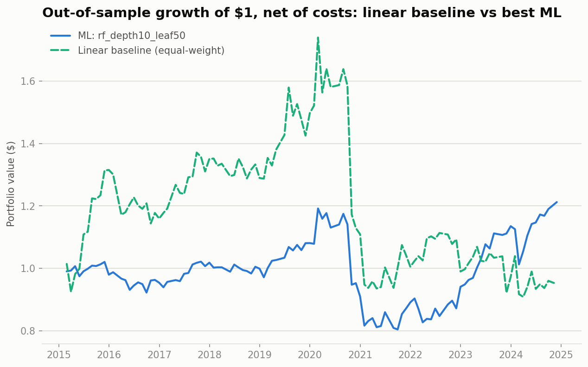

# ML vs. Linear Factors

**Does a machine-learning model that combines momentum, value, and quality beat a plain
equal-weight linear combination of the same three factors, out of sample, in US large-cap
stocks, after trading costs?**

**No — on the pre-registered terms.** The best of 8 machine-learning configurations shows
a higher raw out-of-sample Sharpe than the linear baseline (0.241 vs. 0.066), but its
deflated Sharpe ratio (0.202) falls far short of the ~0.95 bar the pre-registration's
multiple-testing correction requires. Two further checks make this a stronger null than a
Sharpe comparison alone: leave-one-fold-out analysis shows the best configuration's entire
apparent edge comes from a single 12-month window (excluding it, the baseline outperforms
in aggregate), and per-fold permutation importance shows the model isn't learning a stable
relationship with any of the three factors — with the instability localizing to that same
fold. Full write-up: [PAPER.md](PAPER.md) ([PDF](paper/ml-vs-linear-factors.pdf)).

## Headline numbers

| | Baseline (linear) | Best ML (`rf_depth10_leaf50`) |
|---|---|---|
| OOS Sharpe (walk-forward, net of costs) | 0.066 | **0.241** |
| Deflated Sharpe (multiple-testing corrected) | 0.578 (n=1) | **0.202** (n=9, bar ≈0.95) |
| Max drawdown | -47.78% | -32.52% |
| Avg. monthly turnover | 37.12% | 100.57% |

*The deflated Sharpe row uses different conventions for each side on purpose — n=1 for the
baseline (a fixed, pre-specified benchmark) and n=9 for ML (the honest cost of searching 8
configurations) — and read alone it invites the wrong conclusion. Scored under the same
n=9 convention, the baseline's deflated Sharpe is **0.093**, not 0.578 — lower than ML's,
not higher. Under either convention, ML's raw Sharpe is higher, but neither side clears
the ≈0.95 bar. Full breakdown, both conventions side by side:
[`results/comparison/README.md`](results/comparison/README.md).*



## Could this design have found a real edge? (probably not, at any size worth caring about)

Independent of whether ML actually wins, we asked whether this study's design — 109
monthly out-of-sample observations, corrected for testing 9 configurations — could have
detected a genuine edge in the first place. Using the best configuration's own empirical
skew and kurtosis (its returns are meaningfully negatively skewed and fat-tailed, not
close to normal), the design needed an annualized out-of-sample Sharpe of roughly **1.5**
to clear the deflated-Sharpe bar. A genuine edge in the Sharpe 0.3–0.5 range — plausible
for a cost-aware, three-factor strategy — would have been **undetectable by this design at
this sample size, regardless of whether one exists.** The study fails to reject the null,
*and* the design could not have rejected it for any realistic effect size. Full derivation:
[PAPER.md, Section 5.4](PAPER.md#54-statistical-power-could-this-design-have-detected-a-real-edge).

## A limitation stated up front, not buried

**30.7% of point-in-time S&P 500 members (213 of 694) are excluded from this analysis for
lack of available price history**, disproportionately delisted, acquired, and renamed
names. **The direction of the resulting bias is ambiguous for this dollar-neutral
long/short design, and we do not attempt to sign it** — names that went bankrupt would
mostly have sat in the short leg (so dropping them removes short-leg gains a real investor
would have earned), while names acquired at a premium would have moved sharply against a
short position (so dropping them removes short-leg losses a real investor would have
taken). These pull in opposite directions. A Tiingo API key was obtained and spot-checked
on 5 confirmed-delisted names spanning the gap; it had no price history for any of them
(a structural gap in that tier's historical depth, not a code or auth issue — verified
before giving up on the fallback). Full detail: [`results/coverage_gap_note.md`](results/coverage_gap_note.md).

## Pre-registered

The question, hypothesis (stated as a null), exact 9-configuration model grid, and win
condition were committed to [`PREREGISTRATION.md`](PREREGISTRATION.md) at commit
[`02647d5`](https://github.com/robbasnet14/ml-vs-linear-factors/commit/02647d5) on
**2026-07-07** — three weeks before any machine-learning model was trained (first ML
commit `eac614c`, 2026-07-28). Deviations from that original plan (a baseline restatement,
the Tiingo outcome, and a threshold that was described in words but never numerically
fixed) are logged, dated, in a `## Deviations from the original plan` section appended to
that same file — the original text was never edited.

## Repo map

```
PREREGISTRATION.md   the pre-registered question, hypothesis, model grid, win condition
PAPER.md             the full paper (abstract through appendix)
paper/               PAPER.md rendered to PDF
backtester/          the backtesting engine + ML pipeline (see note below)
  src/
    data/            price (Yahoo/Tiingo) + fundamentals (SEC EDGAR) loading, point-in-time universe
    features/        factor calculations, cross-sectional standardization
    backtest/        portfolio construction, cost model, engine, walk-forward validation
    ml/              ML dataset builder, walk-forward model training, permutation importance
    analytics/       metrics (Sharpe, deflated Sharpe, factor IC), coverage report, plots
  scripts/           one script per analysis step (baseline, ML training, comparison,
                     gross-vs-net, statistical power, leave-one-out, feature importance,
                     cost sensitivity, factor IC) — see results/comparison/README.md
  tests/             85 pytest tests, network-mocked
results/
  baseline/          Step 3: linear composite walk-forward OOS reference
  ml/                Steps 4-5: all 8 ML configurations' walk-forward OOS results
  comparison/        Steps 6-7: the comparison table + every robustness check above
  coverage_gap_note.md, ticker_identity_check.md   data-quality investigations
```

**`backtester/` is a vendored snapshot** of the standalone backtesting engine, brought in
at commit `eac614c` ("Bring in factor-backtester code as reused baseline"). The
maintained, independently-evolving version of that engine lives at
[github.com/robbasnet14/factor-backtester](https://github.com/robbasnet14/factor-backtester)
— check there for engine-level fixes made after that commit.

## Reproducing

```bash
cd backtester
pip install -r requirements.txt
python -m pytest -q                                          # 85 tests
PYTHONPATH=. python scripts/run_backtest.py --config config.yaml
PYTHONPATH=. python scripts/run_ml_experiment.py --config config.yaml
PYTHONPATH=. python scripts/compare_ml_vs_baseline.py
PYTHONPATH=. python scripts/gross_vs_net.py
PYTHONPATH=. python scripts/dsr_power_table.py
PYTHONPATH=. python scripts/feature_importance.py
PYTHONPATH=. python scripts/subperiod_table.py
PYTHONPATH=. python scripts/cost_sensitivity.py
PYTHONPATH=. python scripts/factor_ic.py
```

Prices come from Yahoo Finance (no key required); fundamentals from SEC EDGAR (no key
required). A `TIINGO_KEY` env var enables an optional price fallback for some
delisted names — see the coverage-gap note above for why it doesn't close the full gap.

## Full write-up

[PAPER.md](PAPER.md) — abstract through appendix, including the statistical power
analysis (what Sharpe this design could and couldn't have detected), the factor-level
rank IC table, and every self-correction made along the way. A rendered PDF is at
[paper/ml-vs-linear-factors.pdf](paper/ml-vs-linear-factors.pdf).
