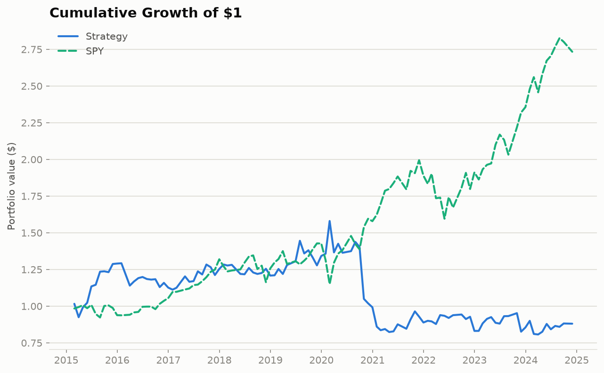

# Factor Backtester

A backtesting engine for long/short equity factor strategies. Each month it ranks
stocks by momentum, value, and quality, buys the best ones, shorts the worst, and
simulates the whole thing on point-in-time data with trading costs — so the numbers
are something you can actually trust.

I built this to understand how factor strategies really behave once you stop cheating:
no peeking at the future, no quietly dropping companies that went bankrupt, no
pretending trading is free. Honestly, most of the work went into *not* fooling myself,
which turns out to be the hard part of backtesting.

## What it does

- Rebuilds the S&P 500 as it actually existed on each date, delisted names included,
  so there's no survivorship bias. (Sanity check I keep coming back to: Lehman shows up
  as a member until it blows up in 2008 and then disappears, which is exactly right.)
- Pulls prices from Yahoo Finance with a Tiingo fallback for delisted names, and
  fundamentals straight from SEC EDGAR (TTM diluted EPS, book value, ROE).
- Computes three factors per stock, per month: 12-1 momentum, earnings yield (value),
  and ROE (quality); standardizes each date's cross-section and blends them.
- Goes long the top decile, short the bottom decile, rebalances monthly, and charges
  8 bps per trade based on turnover.
- Reports the honest version of performance: out-of-sample Sharpe from a walk-forward
  test, a deflated Sharpe that accounts for how many configurations I tried, plus
  drawdown, turnover, and factor coverage.

## Results

S&P 500, 2010–2024, monthly rebalance, equal-weight top-decile-long / bottom-decile-short,
8 bps per-trade cost. The **out-of-sample** column (walk-forward, 10 folds) is the number
that matters; the in-sample column is shown only for reference.

| Metric | Out-of-sample (headline) | In-sample (reference) |
|---|---|---|
| Annualized return | −1.4% | 0.05% |
| Annualized volatility | 18.9% | 16.5% |
| Sharpe ratio | 0.02 | 0.09 |
| Deflated Sharpe (probability) | 0.53 | 0.63 |
| Max drawdown | −48.9% | −44.5% |
| Avg monthly turnover | 39.0% | 38.9% |
| Hit rate | 56.0% | 54.2% |

Mean factor coverage across rebalance dates: composite score 91%, value-and-quality 71%.



### What this means

The honest answer: **a naive momentum/value/quality long–short does not generate
meaningful risk-adjusted returns in large-cap US equities once you account for realistic
costs.** Out of sample the Sharpe is essentially zero (0.02) and the return is slightly
negative, with a deep drawdown. Even in-sample it's weak (0.09). The deflated Sharpe —
which asks whether a result could just be luck given how many variants you tried — sits
around 0.5, basically a coin flip, so there's no evidence of a real edge here.

That's a legitimate finding, not a broken project. Simple factor premia in large, liquid
US names have compressed over the last decade and get eaten by turnover (~39%/month) and
crowding. The whole point of building this carefully — point-in-time universe, no
look-ahead, real costs, walk-forward validation, deflated Sharpe — was to get an answer I
could trust. The answer is "this simple version doesn't beat costs," and a version that
looked great would more likely mean a bug than a discovery.

## Layout

```
src/
  data/       price + fundamentals loading (Yahoo/Tiingo + SEC EDGAR), point-in-time universe
  features/   factor calculations and cross-sectional standardization
  backtest/   portfolio construction, cost model, engine, walk-forward
  analytics/  performance metrics, coverage report, equity-curve chart
scripts/run_backtest.py   the entry point that wires it all together
tests/        62 tests, network-mocked
config.yaml   every knob (universe, dates, costs, factors, validation)
```

## Reproducing this

Prices come from Yahoo Finance (no key). Fundamentals come from SEC EDGAR (no key, but it
wants a descriptive User-Agent, which is set in the loader). A Tiingo key is optional and
only used as a price fallback for a few delisted names — set `TIINGO_KEY` if you have one.

```bash
python -m venv .venv && source .venv/bin/activate   # Windows: .venv\Scripts\activate
pip install -r requirements.txt
python scripts/run_backtest.py --config config.yaml
```

The first run pulls and caches data (slow), and records permanently-unavailable tickers in
`data_cache/*.json` so later runs skip them. Every run after the first reads the cache and
is quick. Outputs land in `outputs/`.

## Some honest caveats

- **Value coverage is ~71%.** Fundamentals are missing for some renamed/delisted tickers,
  and a few multi-share-class names (e.g. Visa) tag EPS in a custom way SEC's API doesn't
  expose. Momentum/quality coverage is higher (~91% composite).
- **~25 delisted positions had no exit price** and were treated as a flat 0% for that
  period. That understates the true outcome (a bankruptcy wipeout is a real loss); the
  price data alone can't tell me which delistings were mergers vs. failures.
- **Costs are a flat 8 bps per trade** — a reasonable stand-in, not the truth; real costs
  vary by name and size.
- **The "embargo" in the walk-forward is a settling gap, not an ML-style leakage guard,**
  because the factors are fixed formulas with nothing trained. There's a note in
  `validation.py`.
- Early-year (2010) coverage is lower because more of that era's names were later
  renamed or delisted.

## Tests

```bash
python -m pytest tests/
```

62 tests, all network-mocked except one opt-in live SEC integration check. They cover the
easy-to-get-wrong stuff: momentum's skip-month, the point-in-time fundamentals lag, the
delisted-name universe, turnover cost math, the yfinance→Tiingo fallback, and — the one I
care about most — a test proving the engine trades on *forward* returns, never
contemporaneous ones.

## Still to do

- Fold weights on "has a current price," not just "has a valid factor score," so a
  delisted name can't be held on a month it never traded.
- A per-name cost model instead of a flat rate.
- A couple more factors (low-vol, size) to see how the mix changes.

## Verifying this yourself

There's no frontend here — no web page, no UI. This is a **backend-only, command-line
pipeline**: you run one Python script, it does its work (network calls, math, file I/O),
and it writes results to files. "Testing it yourself" means two different things, and
they're verified two different ways:

1. **Does the code do what it claims?** → run the automated test suite.
2. **Does the actual pipeline run end-to-end and produce the numbers in this README?** →
   run the script for real and inspect its output.

Here's both, step by step.

### 0. One-time setup

```bash
cd factor-backtester
python -m venv .venv && source .venv/bin/activate   # Windows: .venv\Scripts\activate
pip install -r requirements.txt
```

No API keys required for the default path (Yahoo Finance + SEC EDGAR are both free and
keyless). Skip straight to step 1.

### 1. Run the test suite (fast, offline, ~5 seconds)

```bash
python -m pytest tests/ -v
```

What you're checking: all 62 tests pass. This proves the individual pieces — the momentum
formula, the point-in-time lag on fundamentals, the cost model, the walk-forward fold
logic, the delisting-exit handling, and so on — behave correctly in isolation, using
synthetic data. It does **not** by itself prove real market data flows through cleanly;
that's step 2.

If you want to confirm the tests really are network-free (no silent dependency on your
internet connection), you can disconnect and re-run — everything except one clearly-named
integration test (`test_load_fundamentals_real_aapl_returns_nonempty_2019_2020`) should
still pass.

### 2. Run the real pipeline

```bash
python scripts/run_backtest.py --config config.yaml
```

This is the actual "does it work" test. What happens, in order, and what to watch for:

- **Universe build**: fetches the point-in-time S&P 500 membership history (a public
  GitHub CSV) and prints the ticker count. Should be several hundred.
- **Price + fundamentals download**: hits Yahoo Finance, SEC EDGAR, and occasionally
  Tiingo, for every ticker that's ever been in the universe over the configured date
  range. **This is slow the first time** (the full 2010–2024 S&P 500 universe can take
  a while — expect real wall-clock minutes, not seconds) because it's making one network
  call per ticker with polite rate-limit delays baked in. You'll see per-ticker warnings
  scroll by for names that are delisted or have gaps in fundamentals coverage — that's
  expected, not a failure.
- **Factor computation + backtest**: fast, all local computation once data is loaded.
- **Console output**: a full-period ("in-sample, reference only") summary table, a
  coverage report (composite / value-and-quality coverage per date), a list of the
  walk-forward fold boundaries, and the out-of-sample ("headline") summary table —
  this is where the numbers in this README's Results table come from.
- **Files written to `outputs/`**: `net_returns.csv`, `oos_net_returns.csv`,
  `coverage_report.csv`, `equity_curve.png`, `equity_curve_oos.png`.

**Sanity checks after it finishes:**

- `outputs/equity_curve_oos.png` exists and opens — it should show two lines (strategy vs.
  SPY) starting at $1 and diverging over time.
- The printed "Walk-forward OUT-OF-SAMPLE summary" numbers roughly match the Results table
  above (they won't be bit-for-bit identical if your data cache differs slightly, e.g. a
  ticker that's delisted since I last ran this, but they should be in the same
  ballpark — Sharpe near 0, not suddenly 2.0).
- `outputs/coverage_report.csv` — spot check that `composite_coverage` is high (~90%) and
  `value_quality_coverage` is meaningfully lower (~70%), matching the caveat above about
  fundamentals gaps.

### 3. Confirm the caching actually works

```bash
time python scripts/run_backtest.py --config config.yaml
```

Run it a second time and time it. The first run is slow (network-bound); this second run
should be dramatically faster (seconds, not minutes) because every price/fundamentals call
now hits the local Parquet cache in `data_cache/` instead of the network. If the second run
is just as slow as the first, something's wrong with the caching — worth flagging.

### 4. (Optional) Poke at one piece directly

If you want to verify a specific claim without running the whole pipeline, you can call
the library functions directly from a Python shell:

```python
from src.data.loader import load_prices, load_fundamentals
from src.data.universe import build_universe

# Real AAPL prices, no mocking:
load_prices(["AAPL"], "2020-01-01", "2020-01-15", "data_cache")

# Real SEC fundamentals — TTM EPS, book value, ROE, all point-in-time:
load_fundamentals(["AAPL"], "2019-01-01", "2020-06-30", lag_days=90, cache_dir="data_cache")

# Confirm Lehman Brothers shows up as a member and then disappears in Sept 2008:
u = build_universe("SP500", "2008-06-01", "2008-10-01", cache_dir="data_cache")
u["LEHMQ"]
```

That last one is the single sanity check I trust most: if a backtester quietly drops
bankrupt companies instead of holding them through the crash, its returns are fiction.
Seeing Lehman present-then-gone at exactly the right date is what convinced me this one
isn't doing that.
