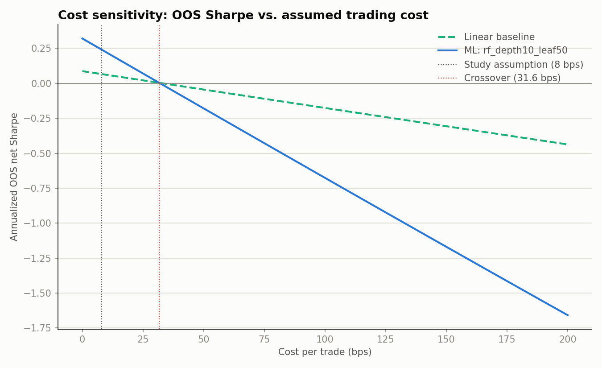

# Step 6 — Compare

> **Corrected 2026-10-07.** The published results below contained a
> look-ahead leak in the value factor. This file keeps every published
> figure and adds the corrected ones beside them where the correction
> re-computed them (`../correction/FACTS.md`). Sections the correction did
> not re-run are marked "published run only." Corrected, no ML
> configuration beats the baseline (0 of 8), and the baseline itself is
> negative (Sharpe −0.174).

Built by `backtester/scripts/compare_ml_vs_baseline.py`, which reads the
already-saved stitched walk-forward OOS return series from Step 3
(`results/baseline/oos_net_returns.csv`) and Steps 4-5
(`results/ml/ml_oos_net_returns_<config>.csv`) and recomputes Sharpe,
deflated Sharpe, annualized return, max drawdown, and hit rate directly
from those series — a check against, not a copy of, `results/baseline/README.md`
and `results/ml/README.md`. The recomputed numbers matched those READMEs
exactly. Turnover is computed from the published holdings — the weights the
correction re-run saved in its `published` mode, which reproduces every
published return series exactly (`../correction/published/holdings/`) — the
same way the original runs computed it. It was previously carried over by
hand from the Step 3/5 run; the computed figures match those to the two
decimals reported.

## Comparison table

Published run, with the corrected out-of-sample Sharpe beside it.

| Config | OOS Sharpe | Corrected OOS Sharpe | Deflated Sharpe | n_trials | Ann. return | Max drawdown | Hit rate | Turnover | Periods |
|---|---|---|---|---|---|---|---|---|---|
| **baseline (linear, equal-weight)** | 0.066 | −0.174 | 0.578 | 1 | -0.57% | -47.78% | 55.96% | 37.12% | 109 |
| gbm_lr0.03_depth3 | 0.160 | −0.361 | 0.146 | 9 | 1.23% | -38.05% | 53.21% | 71.59% | 109 |
| gbm_lr0.03_depth5 | -0.036 | −0.517 | 0.052 | 9 | -1.20% | -36.98% | 46.79% | 89.21% | 109 |
| gbm_lr0.1_depth3 | 0.066 | −0.421 | 0.093 | 9 | -0.02% | -37.08% | 54.13% | 79.07% | 109 |
| gbm_lr0.1_depth5 | 0.145 | −0.590 | 0.137 | 9 | 1.01% | -28.34% | 55.96% | 97.27% | 109 |
| rf_depth5_leaf50 | -0.009 | −0.404 | 0.061 | 9 | -1.11% | -44.77% | 55.05% | 82.48% | 109 |
| rf_depth5_leaf200 | -0.357 | −0.423 | 0.004 | 9 | -5.26% | -53.55% | 47.71% | 81.50% | 109 |
| **rf_depth10_leaf50 (best of 8, published)** | **0.241** | **−0.457** | **0.202** | 9 | 2.14% | -32.52% | 59.63% | 100.57% | 109 |
| rf_depth10_leaf200 | -0.220 | −0.471 | 0.014 | 9 | -2.79% | -39.97% | 46.79% | 100.38% | 109 |

Full precision in `comparison_table.csv` (published) and
`../correction/tables/sharpe_by_config.csv` (all three correction modes).
The baseline and gbm_lr0.1_depth3 both print as 0.066 published, but are
0.06606 and 0.06564: three configurations beat the baseline in the
published run, not four. Corrected, the best configuration is
gbm_lr0.03_depth3 (−0.361, deflated Sharpe 0.005, max drawdown −55.8%).

## Win condition

Per `PREREGISTRATION.md`: ML wins only if a config's OOS Sharpe beats the
baseline's **and** its deflated Sharpe (n_trials=9) stays above the ~0.95
bar. Published: `rf_depth10_leaf50` clears the first test (0.241 vs 0.066)
but not the second (0.202 vs ~0.95) — **the win condition is not met.**
Corrected: no configuration clears even the first test — the best,
gbm_lr0.03_depth3 at −0.361, is below the baseline's −0.174. Both are
consistent with the pre-registered null hypothesis.

## Equity curve

*Published run only.* `equity_overlay_baseline_vs_best_ml.png` — OOS growth of $1 (net of 8bps
costs), baseline vs `rf_depth10_leaf50`. The baseline's swings are much
wider (including the 2020 spike and crash that drives its -47.78% max
drawdown); the best ML config is steadier but never builds a durable edge
over the full window, consistent with its Sharpe being statistically
indistinguishable from noise once the search over 9 configurations is
priced in.

## Both n_trials conventions, side by side

The table above uses n_trials=1 for the baseline (a fixed, pre-specified
benchmark) and n_trials=9 for every ML config (the honest cost of the
search). That asymmetry is correct, but shown alone it invites misreading
the baseline as "better" (DSR 0.578 vs 0.202). Here both arms under both
conventions, so nothing is hidden:

| Config | Sharpe | DSR @ n_trials=1 | DSR @ n_trials=9 |
|---|---|---|---|
| baseline, published | 0.066 | 0.578 | 0.093 |
| rf_depth10_leaf50 (best ML), published | 0.241 | 0.754 | 0.202 |
| baseline, corrected | −0.174 | 0.294 | 0.020 |
| gbm_lr0.03_depth3 (best ML), corrected | −0.361 | not tabulated | 0.005 |

Published, under either convention the ML config's raw Sharpe is higher,
but neither arm clears 0.95 at n_trials=9 — the honest number for a
9-config search. Corrected, the ML config's raw Sharpe is lower than the
baseline's, and both deflated Sharpe ratios are near zero.

## Gross-of-cost vs net-of-cost (is the signal real but untradeable, or not real?)

*Published run only; not re-run for the correction.*

Built by `backtester/scripts/gross_vs_net.py`, which re-derives weights
exactly as the committed pipeline does, then stitches walk-forward OOS
results with the new `run_backtest_breakdown` (same fold boundaries, same
delisting-exit handling as `run_backtest` — see `src/backtest/engine.py`)
so gross and net come from one pass over the same data. Its net_return
output was cross-checked against `results/baseline/oos_net_returns.csv`
(max abs diff 9.7e-17, i.e. float noise) before trusting the gross column.

| Config | Gross Sharpe | Net Sharpe | Cost drag (Sharpe pts) | Gross DSR | Net DSR | Turnover |
|---|---|---|---|---|---|---|
| baseline | 0.087 | 0.066 | 0.021 | 0.602 | 0.578 | 37.12% |
| gbm_lr0.03_depth3 | 0.209 | 0.160 | 0.049 | 0.180 | 0.146 | 71.59% |
| gbm_lr0.03_depth5 | 0.032 | -0.036 | 0.068 | 0.077 | 0.052 | 89.21% |
| gbm_lr0.1_depth3 | 0.122 | 0.066 | 0.056 | 0.123 | 0.093 | 79.07% |
| gbm_lr0.1_depth5 | 0.222 | 0.145 | 0.078 | 0.193 | 0.137 | 97.27% |
| rf_depth5_leaf50 | 0.048 | -0.009 | 0.057 | 0.084 | 0.061 | 82.48% |
| rf_depth5_leaf200 | -0.297 | -0.357 | 0.060 | 0.007 | 0.004 | 81.50% |
| **rf_depth10_leaf50** | **0.321** | **0.241** | **0.080** | **0.267** | **0.202** | 100.57% |
| rf_depth10_leaf200 | -0.129 | -0.220 | 0.090 | 0.028 | 0.014 | 100.38% |

Full precision in `gross_vs_net.csv`.

**Reading this:** `rf_depth10_leaf50`'s cost drag (0.080 Sharpe points) is
roughly 4x the baseline's (0.021), tracking its ~2.7x turnover. But even
its **gross-of-cost** deflated Sharpe (0.267) falls far short of the ~0.95
bar. Costs make the result worse, but they are not what's driving the
non-result — the finding is "no detectable edge," not "an edge that costs
ate." Every other ML config's gross DSR is lower still.

## Statistical power: could this design have detected a real edge?

*Published run only: the skew and kurtosis below are the published `rf_depth10_leaf50` series'; not re-run for the correction.*

Built by `backtester/scripts/dsr_power_table.py`, which inverts the
`deflated_sharpe` formula (root-finds the annualized Sharpe needed to hit a
target DSR, at n_trials=9, given a sample size and skew/kurtosis) rather
than assuming a generic normal-returns approximation. Using
`rf_depth10_leaf50`'s own empirical skew (-1.35) and kurtosis (9.43, vs 3
for normal) — its OOS returns are meaningfully negatively skewed and
fat-tailed, which raises `deflated_sharpe`'s variance term and therefore
the bar:

| OOS months | Ann. Sharpe needed for DSR ≥ 0.50 | for DSR ≥ 0.95 |
|---|---|---|
| 80 | 0.69 | 1.90 |
| 100 | 0.60 | 1.58 |
| **109 (this study)** | **0.57** | **1.48** |
| 118 | 0.55 | 1.39 |
| 130 | 0.52 | 1.30 |
| 150 | 0.48 | 1.17 |

For comparison, the same table under a normal-distribution assumption
(skew=0, kurt=3) is close to but somewhat more lenient than the empirical
one (e.g. at 109 months: 0.51 / 1.08 vs 0.57 / 1.48) — full detail in
`dsr_power_table.csv`.

**Reading this:** at 109 OOS months and n_trials=9, this design needed an
annualized OOS Sharpe of roughly 1.5 to declare a win at DSR ≥ 0.95 — using
this study's own return-distribution shape, not a normal approximation
that would understate the bar. A genuine edge in the Sharpe 0.3-0.5 range
(roughly what the honest ML-vs-linear-factors literature finds after
costs) would be **undetectable** by this design at this sample size and
this multiple-testing correction. The paper's finding is therefore two
things, not one: (1) we fail to reject the null, and (2) the design could
not have rejected it for any realistic effect size — a materially
different and stronger claim than "ML didn't win."

## Step 7: leave-one-out — the entire apparent edge is one fold

*Published run below.* The correction re-ran this table: `../correction/tables/leave_one_out.csv` has the published rows (identical to the table below) and the corrected ones, in which `rf_depth10_leaf50` is below the baseline whichever fold is dropped (fold 7 dropped: −0.495 against −0.107). The correction also explains the published finding: with the leak corrected and nothing else changed, `rf_depth10_leaf50`'s summed net monthly return in fold 7 falls from +0.280 to +0.001 (baseline −0.067 to −0.123; `../correction/tables/per_fold.csv`).

Built by `backtester/scripts/subperiod_table.py`. For each of the 10
walk-forward folds, drop that fold's periods from the pooled OOS series
and recompute Sharpe on what's left, for both arms — the standard
robustness check for "does this result depend on one window."

| Fold dropped | Baseline Sharpe | ML Sharpe | ML − baseline |
|---|---|---|---|
| 0 | -0.114 | +0.269 | +0.384 |
| 1 | +0.123 | +0.290 | +0.167 |
| 2 | -0.006 | +0.208 | +0.214 |
| 3 | +0.047 | +0.234 | +0.187 |
| 4 | -0.036 | +0.162 | +0.198 |
| 5 | +0.390 | +0.646 | +0.256 |
| 6 | -0.003 | +0.279 | +0.282 |
| **7** | **+0.115** | **-0.024** | **-0.138** |
| 8 | +0.111 | +0.192 | +0.082 |
| 9 | +0.073 | +0.224 | +0.152 |
| none (full sample) | +0.066 | +0.241 | +0.175 |

Full precision in `leave_one_out_sharpe.csv`.

**This is the headline finding of Step 7, and it overturns the earlier
draft's win-rate framing.** Dropping fold 7 alone takes `rf_depth10_leaf50`
from Sharpe 0.241 to **-0.024** — the only fold whose removal flips the
sign of ML's advantage, by a wide margin (next-largest swing is 0.09). The
cumulative-return numbers say the same thing, and more starkly than an
earlier draft of this section stated: ML's total advantage over the
baseline across all 10 folds is +16.9pp (see the per-fold table below);
fold 7 alone contributes **+38.4pp** to that (its ML cum. return of +31.26%
minus the baseline's -7.14% in that same window) — **more than the entire
net advantage**. Every other fold, combined, nets to **-21.5pp** — ML
underperforms the baseline once fold 7 is excluded, not merely "loses its
edge." **The best-performing ML configuration's entire apparent edge over
the linear baseline comes from a single 12-month window
(2022-09 to 2023-09), and every other window it was tested on actually
favored the baseline.**

## Step 7: per-fold Sharpe, on the pre-registered fold boundaries

*Published run only; not re-run for the correction.* Corrected fold-level summed net returns for the baseline and `rf_depth10_leaf50`, beside the published ones, are in `../correction/tables/per_fold.csv`.

| Fold | Test window | Baseline Sharpe | Baseline cum. return | ML Sharpe | ML cum. return |
|---|---|---|---|---|---|
| 0 | 2015-02 → 2016-02 | 1.529 | +30.13% | -0.172 | -1.23% |
| 1 | 2016-03 → 2017-03 | -0.616 | -8.41% | -0.396 | -3.14% |
| 2 | 2017-04 → 2018-04 | 1.082 | +12.05% | 1.090 | +4.89% |
| 3 | 2018-05 → 2019-05 | 0.367 | +3.35% | 0.393 | +2.33% |
| 4 | 2019-06 → 2020-06 | 0.674 | +14.58% | 0.816 | +10.13% |
| **5** | **2020-07 → 2021-07** | **-1.304** | **-36.58%** | **-1.151** | **-23.99%** |
| 6 | 2021-08 → 2022-08 | 0.762 | +11.05% | -0.054 | -1.42% |
| **7** | **2022-09 → 2023-09** | **-0.539** | **-7.14%** | **2.803** | **+31.26%** |
| 8 | 2023-10 → 2024-10 | -0.243 | -7.16% | 0.577 | +7.02% |
| 9 | 2024-11 → 2024-12 (partial, 1 period) | n/a | -1.08% | n/a | +1.87% |

**ML's Sharpe beats the baseline's in 7 of 9 full folds — but this win
rate is misleading on its own, and an earlier draft of this section relied
on it incorrectly.** It counts wins without weighting them: 4 of the 7
"wins" are near-rounding-error (e.g. fold 2: 1.090 vs 1.082) and three of
those actually have *lower* cumulative return than the baseline — ML wins
those on lower volatility, not better returns. Meanwhile its two losses
are large (fold 0: baseline +30.1% vs ML -1.2%; fold 6: +11.1% vs -1.4%),
and its one enormous win (fold 7: -7.1% vs +31.3%) is doing essentially all
the work — see the leave-one-out table above for the direct evidence.
**Do not cite the "7 of 9" win rate as evidence of a broad-based edge.**

**Fold 5 (2020-07 to 2021-07) is where both arms take their worst loss by
a wide margin** — baseline -36.58%, driving most of its full-sample
-47.78% max drawdown; ML -23.99%. This window is the sharp value/
low-quality rally that followed the March 2020 crash, in which
previously-beaten-down names (a momentum strategy's short leg) violently
reversed — the pattern Daniel & Moskowitz document in "Momentum Crashes"
(2016): momentum's short leg is most exposed precisely when a bear market
is ending, because that's when past losers are most likely to rebound
sharply. Fold 4 (2019-06 to 2020-06, containing the crash itself) shows
both arms positive, with the damage instead landing in the slower
rotation that followed.

## Step 7: feature importance — unstable, and it converges with the leave-one-out finding

*Published run only; not re-run for the correction.*

Built by `backtester/scripts/feature_importance.py`, using
`src/ml/importance.py`'s per-fold permutation importance (not
`feature_importances_`, which is computed on training data and biased
toward more-split-opportunity features) scored by cross-sectional rank IC
(Spearman correlation of predicted score vs. realized forward return,
within each OOS month, averaged over the fold) — the metric this
decile-ranking strategy actually depends on, not R^2 on pooled returns.
**Computed on the 9 full folds only** — fold 9 is truncated to a single
OOS date (2024-11-01 to 2024-12-31, per the config's Nov-Dec 2024 partial
window), and a single date's rank IC is one Spearman correlation, not an
average; including it would over-weight it relative to the other folds
(`src.ml.importance.permutation_importance_per_fold` now reports
`n_test_dates` per fold so this is explicit and filterable, not silent).

**Lead finding: the standard deviation of importance across the 9 full
folds is larger than the mean, for all three features — and it gets more
pronounced once fold 9 is excluded, not less.**

| Feature | Mean importance | Std across folds |
|---|---|---|
| val_z | 0.0107 | 0.0203 |
| qual_z | 0.0030 | 0.0114 |
| mom_z | 0.0018 | 0.0130 |

The feature with the *highest* importance flips fold to fold — val_z wins
5 of 9, mom_z 2, qual_z 2, with no consistent leader. In 3 of 9 folds
(1, 2, 5), `rf_depth10_leaf50`'s raw (unpermuted) predictions were
themselves **negatively** rank-correlated with realized forward returns.
Full per-fold detail in `feature_importance_per_fold.csv`.

**This converges with the leave-one-out finding, not just parallels it:
fold 7 — the single fold that drives all of ML's apparent edge — is also
where val_z's importance peaks (0.0588, roughly 3x any other fold) and
where the baseline rank IC is the highest of any full fold.** One window
where value happened to work, with no evidence it carries over to any
other fold. Combined with the leave-one-out result, this points to the
same conclusion by two independent routes: `rf_depth10_leaf50` is not
learning a stable relationship with any of the three factors, and its
0.241 headline Sharpe is one regime's value bet, not a repeatable edge.

## Step 7: cost sensitivity — caveated, not a supporting result

*Published run only; not re-run for the correction.*

Built by `backtester/scripts/cost_sensitivity.py`. Cost is linear in bps
(`turnover * bps / 1e4`), so this needed one walk-forward pass per arm at
a reference cost, then a closed-form rescaling across the bps grid.



The pooled crossover (where ML's raw Sharpe advantage over the baseline
hits zero) is ~31.6 bps/trade, about 4x the study's 8bps assumption. **This
number should not be read as "ML's edge is robust to cost assumptions" —
the leave-one-out result above shows the pooled advantage this sweep is
built on does not survive leaving out fold 7, so the crossover describes
the durability of a pooled effect that isn't a genuine, broad-based edge
to begin with.** It's retained here only as a secondary, narrower fact
(how sensitive the *pooled* number is to costs, for anyone reading the
Sharpe/DSR sections above), not as evidence for or against ML's viability.
It has no bearing on why ML failed to win: the unstable, fold-7-driven
feature importances above are the closer-to-mechanistic answer for that.
Full grid in `cost_sensitivity.csv`.

## Reproducing

```bash
cd backtester
PYTHONPATH=. python scripts/compare_ml_vs_baseline.py
PYTHONPATH=. python scripts/gross_vs_net.py
PYTHONPATH=. python scripts/dsr_power_table.py
PYTHONPATH=. python scripts/feature_importance.py   # writes feature_importance_per_fold.csv
PYTHONPATH=. python scripts/subperiod_table.py       # writes per_fold_subperiods.csv AND leave_one_out_sharpe.csv
PYTHONPATH=. python scripts/cost_sensitivity.py
```
